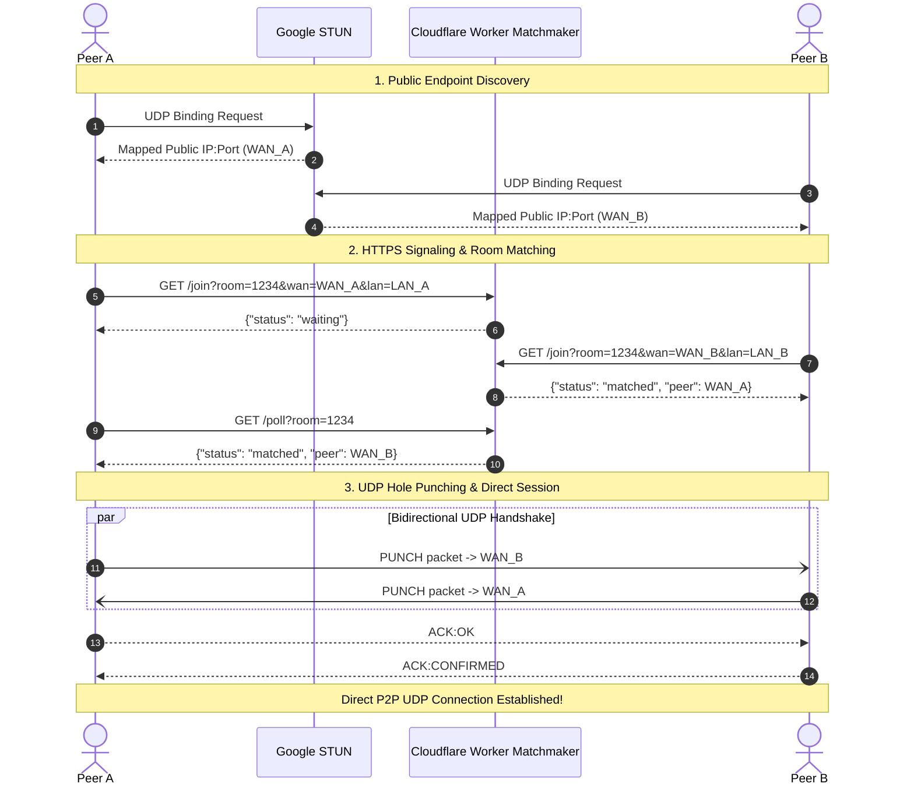

# ⚡ P2P UDP Hole Puncher

A lightweight, zero-dependency peer-to-peer UDP hole puncher in Python with a serverless Cloudflare Worker matchmaker and RFC 5389 STUN discovery. Connect any two devices directly across NATs and firewalls without port forwarding or central relay servers.


-brightgreen.svg)


---

## ✨ Features

- **Zero External Dependencies**: Pure Python standard library (`socket`, `struct`, `threading`, `urllib`). No `pip install` required.
- **RFC 5389 STUN Client**: Built-in binary STUN parser (`stun.py`) discovering public WAN mappings via Google STUN.
- **Serverless Matchmaker**: Free-tier Cloudflare Worker (`cloudflare/worker.js`) coordinating room handshakes over HTTPS.
- **Intelligent LAN/WAN Routing**: Automatically detects if both peers share the same public IP and seamlessly prioritizes direct LAN communication.
- **NAT Pin-Hole Keepalive**: Background heartbeat ensures router NAT translation mappings stay active.
- **Developer-Friendly API**: Import `UDPHolePuncher` directly into your own games, VoIP, or IoT projects.

---

## 🔄 How It Works



---

## 🚀 Quickstart

Run on two different machines (across separate Wi-Fi, cellular, or NAT networks):

### Device 1:
```bash
python peer.py --room 1234
```

### Device 2:
```bash
python peer.py --room 1234
```

> **Tip:** You can also run `python peer.py` without flags to launch the interactive terminal wizard.

---

## 💻 Python Library Usage

You can embed the hole puncher into your own applications:

```python
from peer import UDPHolePuncher, join_http_room, parse_endpoint

# 1. Initialize puncher and discover public WAN endpoint via STUN
puncher = UDPHolePuncher()
pub_ip, pub_port = puncher.discover_public_endpoint()
my_wan = f"{pub_ip}:{pub_port}"
my_lan = f"127.0.0.1:{puncher.local_port}"

# 2. Exchange endpoints using the matchmaker (room key)
peer_wan, peer_lan = join_http_room(
    server_url="https://udp-matchmaker.lvmlabs.org",
    room_key="my-secret-room",
    wan_endpoint=my_wan,
    lan_endpoint=my_lan
)

# 3. Register message callback
puncher.on_message = lambda msg: print(f"Received from peer: {msg}")

# 4. Punch hole and establish P2P connection
target_ip, target_port = parse_endpoint(peer_wan)
puncher.start(target_ip, target_port)

# 5. Send message directly peer-to-peer!
puncher.send_message("Hello directly over UDP!")
```

---

## ⚙️ CLI Reference

```text
usage: peer.py [-h] [--port PORT] [--server SERVER] [--room ROOM]
               [--peer PEER] [--stun STUN] [--stun-port STUN_PORT]

options:
  -h, --help            Show this help message and exit
  --port PORT           Local UDP port to bind (default: 0 / dynamic OS port)
  --server SERVER       HTTP Matchmaker URL (default: https://udp-matchmaker.lvmlabs.org)
  --room ROOM           Room key to pair with peer (e.g. 1234)
  --peer PEER           Direct remote endpoint (<IP>:<Port>) for manual punch without matchmaker
  --stun STUN           STUN server hostname (default: stun.l.google.com)
  --stun-port STUN_PORT STUN server port (default: 19302)
```

---

## 📁 Repository Structure

```text
udptest/
├── peer.py               # P2P UDP client & interactive terminal chat
├── stun.py               # RFC 5389 STUN binary protocol implementation
├── README.md             # Documentation and usage guide
└── cloudflare/           # Serverless matchmaker service
    ├── worker.js         # Matchmaker API (/join and /poll endpoints)
    └── wrangler.toml     # Cloudflare Workers configuration
```

---

## 🌐 Self-Hosting the Matchmaker (Cloudflare Worker)

A live public matchmaker is pre-configured at `https://udp-matchmaker.lvmlabs.org`.

To deploy your own free instance on Cloudflare Workers:

1. Install the Cloudflare Wrangler CLI:
   ```bash
   npm install -g wrangler
   ```
2. Authenticate:
   ```bash
   wrangler login
   ```
3. Deploy from the `cloudflare` folder:
   ```bash
   cd cloudflare
   wrangler deploy
   ```
4. Run `peer.py` pointing to your custom worker:
   ```bash
   python peer.py --server https://<your-worker>.<your-subdomain>.workers.dev --room 1234
   ```

---

## 🛡️ NAT Compatibility

| NAT Type | Behavior | Hole Punching Supported? |
| :--- | :--- | :---: |
| **Full Cone** | External port is preserved and open to any remote address | ✅ Yes |
| **Restricted Cone** | External port is preserved; accepts packets from queried IPs | ✅ Yes |
| **Port-Restricted Cone** | External port is preserved; accepts packets from queried IP:Port | ✅ Yes |
| **Symmetric NAT** | External port is randomized per destination address | ⚠️ Requires TURN relay |

---

## 📄 License

MIT
